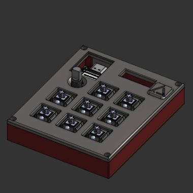

# Spotify-Macropad

The Macropad here was designed with Ki-CAD for the PCB, and OnShape for the casing.
## Images

# Overall

# PCB

PCB Schematic

Final Picture of Routing

# Case

## Uses
Desiged to control spotify via the app independently of main keyboard and without having the screen in focus.
## Components
4 M3 Heat-set Inserts

1 EC11 Vertical Rotary Encoder

8 Cherry-MX keyswitches with keycaps

1 SSD1306 OLED module

1 XIAO RP-2040 DIP

1 Custom Designed PCB :D
## Resources used
While designing, I used alot of resources, and I wanted to list them for anyone else
- Hack Club's DIY Macropad Guide
- Joe Scotto's Guide on matrix systems on keyboards (Youtube)
- GrabCAD for getting the 3D models for all of my components in the PCB CAD
- QMK MSYS for setting up firmware, and their guides on the Web to understand how it worked
- Corbin's guide to GitHub for beginners (Youtube)

## Final Note
I had a ton of fun making this project and learned alot about so many things, from Heat-set inserts, to PCB design and even how to use github. I wanted to thank Hack-Club for making this opportunity available for teens around the world.
